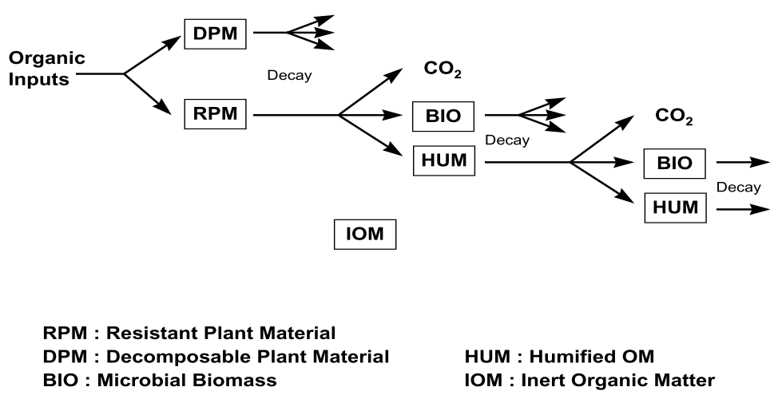

```{r, include = FALSE}
knitr::opts_chunk$set(
  collapse = TRUE,
  comment = "#>"
)
```

```{r setup}
library(rotsee); library(data.table); library(ggplot2)
```


## 1. what is rotsee?
Rotsee provides a calculation core for performing RothC calculations. Data pre-processing is left
to the user to make application universal, yet the package provides several functions to
facilitate this process. 


## 2. basis of the RothC model
An extensive description of the RothC model can be found in Coleman and Jenkinson, 1996.
RothC is a well-established model to calculate the development of carbon (C) stocks in soils
based on long-term experimental data from Rothamsted. RothC uses 5 C pools to describe
carbon turnover. The inert organic matter (IOM) pool is fixed and based on the calculation
developed by Fallon et al., 1998. Remaining four pools are all active and are in order
of highest to lowest decomposition rate: decomposable plant material (DPM), resistant plant material (RPM),
microbial biomass (BIO) and humified organic matter (HUM). Their decomposition rates -
adjusted with rate modifying factors based on temperature, soil moisture, and crop cover -
are used to calculate C removal from and transfer between the different pools. Together with C
inputs from crops and amendments, the model calculates changes in C stocks at a monthly resolution.
A representation of the overall model functionality is listed in Figure 1.

```{r Figure 1, echo = FALSE, out.width = '70%'}



```


## 3. required and optional data
### 3.1 soil properties
Provide clay and organic matter content, together with the dry soil bulk density. If the bulk
density is unknown, it can be calculated using `rc_calculate_bd`.

### 3.2 crop rotation data (optional)
Information on the crop rotation, including start and end of crop growth, crop humification
coefficient, and carbon input from crops. If the latter is not known, it can be calculated based
on crop harvest characteristics using `rc_calculate_b_c_of`. Crop rotations can be extended
to encompass longer simulation periods using `rc_extend_crops`.

### 3.3 amendment data (optional)
Information on the applied amendment, including application date, amendment humification
coefficient, and carbon input from the amendment. Amendment applications can be extended
to encompass longer simulation periods using `rc_extend_amendments`.

### 3.4 weather data (optional)
Monthly weather data, which includes mean temperature, mean precipitation, and actual
evapotranspiration (ET) or reference ET with a factor to re-calculate to actual ET.
Weather data can either be provided for each month (in which case it will be extended across
each year of the simulation period) or for each month and each year in the simulation. If 
weather data is not provided, Dutch averages will be used.
TO DO once branch facil-refact is merged add description of facilitating implementation of factor

### 3.5 sampling information
Information on the depth of the cultivation layer and the sampling depth.

### 3.6 Model parameters (optional)
Parameters to define model run operation. These include standard RothC parameters 
(initial pool distribution, pool-dependent decomposition rates), together with parameters
steering the calculation: type of pool initialization, output unit, method of solving 
linear differential equations, resolution of data output, and the start and end date
of the simulation.


## 4. Model operation

### 4.1 pool initialization
An important aspect of RothC is the initialization of the C pools. Rotsee implements this using
either pre-defined pools or initialization calculations.

Pre-defined pools are defined via the 'c_fractions' parameter. These can be defined by the user,
otherwise the RothC defaults are used: fr_IOM = 0.049; fr_DPM = 0.015; fr_RPM = 0.125; fr_BIO = 0.015.
**Note: pre-defined pools are overwritten if initialization calculations are requested**

**Note: initialization calculations are not yet implemented. The above will be active once ghsolver branch is merged**
Initialization calculations can be requested using the parameter initialize. If no initialization
is wanted, initialize should be set to FALSE. Three initialization options exist, which can be selected
based on system state. 
If C stocks are developing and the pool size is expected to be in equilibrium, initialize should be
set either to 'spinup_analytical' or to 'spinup_analytical_bodemcoolstof'. 'spinup_analytical'
conducts the rotsee calculation for 150 years to establish equilibrium pools, 'spinup_analytical_bodemcoolstof'
calculates the pools based on the initialization of Bodemcoolstof (Hendriks et al., 2021).
If C stocks are in equilibrium, initialize should be set to 'spinup_heuvelink'


### 4.2 C inputs
In RothC there exist two types of C inputs into the soil: crops and amendments. Both
are described in a similar fashion, using an input event (specific month) and a total
C input into the soil. Once C enters the soil, it is distributed among the different C pools
based on the humification coefficient. This distribution is expressed in the fraction DPM-to-RPM
(fr_DPM_RPM), which if no humification coefficient is provided is defaulted to 1.44. Crop
C inputs are directly distributed over DPM and RPM; for amendments a default 2% enters the
HUM pool.


### 4.3 simulation duration
Simulation duration can be set directly using the 'start_date' and 'end_date' parameters.
If these parameters are not provided, the simulation period is based on the earliest 
and latest crop and/or amendment application dates.

## 5. model output
Model calculation provides soil C stock as a function of time. The exact output depends on
user-provided model parameters (see section 3.6)

Requested model outputs can be altered both with respect to temporal resolution and
returned units and pool definitions of the C stocks. Output can be requested either on
a monthly or a yearly basis; this can be adapted with the parameter 'poutput'. Output units
can be adapted with the parameter 'unit', which allows the following options:
- A_SOM_LOI, providing the organic matter content in \% 
- psoc, providing the organic carbon content in g C/kg
- psomperfraction, providing the organic matter content of the individual pools in \%
- cstock, providing the carbon stock of each fraction in kg C/ha


## 6. Helper functions
To facilitate the user in using the rotsee package, several helper functions have been introduced.
For this we refer you to the [helpers vignette](helpers.html).

## 7. Example runs

TO DO

## 8. references
Coleman, K., & Jenkinson, D. S. (1996). RothC-26.3-A Model for the turnover of carbon in soil. In Evaluation of soil organic matter models: Using existing long-term datasets (pp. 237-246). Berlin, Heidelberg: Springer Berlin Heidelberg.

Falloon, P. D., Smith, P., Coleman, K., & Marshall, S. (1998). Estimating the size of the inert organic matter pool from total soil organic carbon content for use in the Rothamsted carbon model. Soil Biology and Biochemistry, 30(8/9), 1207-1211.

Hendriks, C. M. J., Lesschen, J. P., Timmermans, B., Hanegraaf, M., Dijkman, W., Rougoor, C., & Schepens, J. (2021). Beschrijving en ontwikkeling Praktijktool BodemCoolstof.
